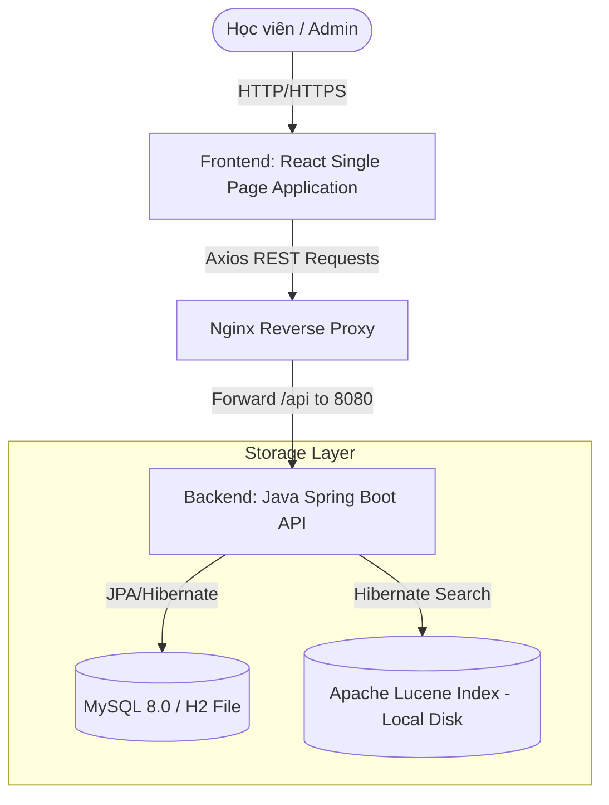
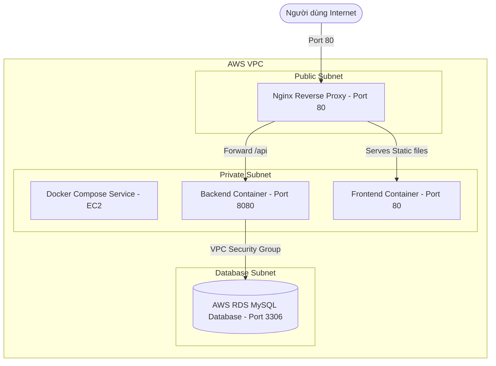

# 🏗️ System Architecture (.ai/knowledge/architecture.md)

Tài liệu này đặc tả kiến trúc tổng quan của dự án **NihongoCards**, làm rõ các khối thành phần, luồng truyền dữ liệu và mô hình hạ tầng mạng trên AWS Cloud.

---

## 1. Sơ đồ khối tổng quan (High-Level Architecture)

Hệ thống tuân thủ mô hình **Client-Server** phân tách độc lập hoàn toàn:

* **Frontend (React)**: Gửi các yêu cầu HTTP/REST API đến Backend và render giao diện.
* **Nginx Reverse Proxy**: Chuyển tiếp các request có tiền tố `/api` đến cổng `8080` (Backend) và trực tiếp phục vụ các tệp tĩnh (Frontend) từ thư mục Nginx.
* **Backend (Spring Boot)**: Nhận yêu cầu, kiểm tra JWT, thực thi logic nghiệp vụ, ghi nhận lịch sử vào DB và cập nhật chỉ mục tìm kiếm Lucene trên đĩa cục bộ.
* **Java 21 Virtual Thread AI Queue Service**: Hàng chờ `BlockingQueue` khử trùng lặp (Deduplicated Queue) kết hợp Virtual Thread Pool (`Executors.newVirtualThreadPerTaskExecutor()`, tối đa 10 luồng ảo song song) xử lý nạp/làm giàu dữ liệu AI ngầm (Background Async Enrichment) không làm gián đoạn trải nghiệm người dùng.

---

## 2. Kiến trúc hạ tầng trên AWS (Production Infrastructure)

Khi chạy trên AWS Production, hệ thống được cấu hình trong một mạng VPC an toàn như sau:

* **Nginx Reverse Proxy**: Đứng ở tầng mạng Public để tiếp nhận yêu cầu từ người dùng internet.
* **Docker Compose trên EC2**: Các container backend và frontend chạy trong môi trường bảo mật, chỉ mở cổng giao tiếp nội bộ hoặc ánh xạ cổng trực tiếp với Nginx.
* **AWS RDS MySQL**: Cơ sở dữ liệu nằm ở subnet riêng biệt, chỉ chấp nhận kết nối từ IP hoặc Security Group của EC2 Instance ở cổng `3306`.
* **AWS Systems Manager (SSM) Agent**: Chạy ngầm trong EC2, cho phép GitLab CI/CD thực thi lệnh cập nhật docker-compose an toàn thông qua IAM role mà không cần mở cổng SSH.

---

## 3. Luồng dữ liệu chính (Core Data Flows)

### A. Luồng Đăng nhập (Authentication Flow)
1. Người dùng gửi tên đăng nhập & mật khẩu đến `POST /api/auth/login`.
2. Backend kiểm tra tên đăng nhập trong DB, so khớp mật khẩu bằng `BCryptPasswordEncoder`.
3. Nếu hợp lệ, backend tạo ra **JWT Token** chứa thông tin username và vai trò, ký số bằng khóa bí mật bí mật (`JWT_SECRET`).
4. Token được trả về cho Frontend và lưu tại `localStorage`. Các yêu cầu tiếp theo sẽ tự động được Axios interceptor thêm vào header `Authorization: Bearer <token>`.

### B. Luồng Ôn tập giãn cách (SRS Flow)
1. Học viên mở Flashcard/Daily Study, frontend gửi yêu cầu lấy từ vựng cần ôn tập.
2. Backend truy vấn các bản ghi `WordReview` có ngày `nextReview` $\le$ ngày hiện tại.
3. Học viên đánh giá từ vựng (Forgot, Hard, Good, Easy).
4. Backend nhận điểm đánh giá, tính toán chu kỳ ôn tập tiếp theo bằng thuật toán **SM-2**, cập nhật `nextReview`, `easeFactor`, `repetition` và lưu vào DB.
5. Tạo bản ghi `StudySession` mới (hoặc cộng dồn từ đã học trong ngày) để cập nhật biểu đồ hoạt động (activity grid).
