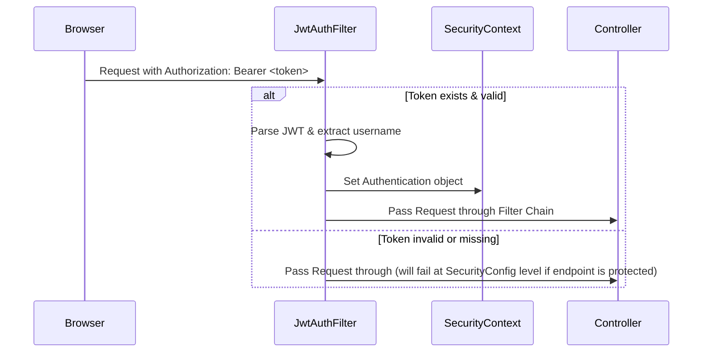

# ☕ Backend Architecture (.ai/knowledge/backend.md)

Tài liệu này đặc tả chi tiết kiến trúc phân lớp, các cấu hình nền tảng, cơ chế lọc bảo mật và quản lý lỗi trong phần backend Java Spring Boot của dự án **NihongoCards**.

---

## 1. Package Structure & Responsibility

Mã nguồn Java nằm dưới package `com.flashcard` và được chia lớp theo mô hình MVC/3-Tier chuẩn:

```
src/main/java/com/flashcard/
├── BackendApplication.java       # Khởi chạy Spring Boot
├── config/                        # Cấu hình bảo mật, nạp dữ liệu mẫu và chỉ mục tìm kiếm
│   ├── ExcelDataLoader.java
│   ├── JwtAuthFilter.java
│   ├── SecurityConfig.java
│   └── SearchIndexer.java
├── controller/                    # RESTful Controllers tiếp nhận REST requests
│   ├── AuthController.java
│   ├── VocabularyController.java
│   ├── SrsController.java
│   ├── UserSettingController.java
│   ├── AnalyticsController.java
│   └── ImportController.java
├── model/                         # Các thực thể JPA Entity
│   ├── User.java
│   ├── Vocabulary.java
│   ├── UserSetting.java
│   ├── WordReview.java
│   └── StudySession.java
├── repository/                    # Spring Data JPA repositories kết nối DB
│   ├── UserRepository.java
│   ├── VocabularyRepository.java
│   ├── UserSettingRepository.java
│   ├── WordReviewRepository.java
│   └── StudySessionRepository.java
└── service/                       # Logic xử lý nghiệp vụ chính
    ├── AuthService.java
    ├── VocabularyService.java
    ├── SrsService.java
    ├── UserSettingService.java
    ├── AnalyticsService.java
    ├── ExcelImportService.java
    └── OnlineUserService.java
```

---

## 2. Spring Security & JWT Filter

Cơ chế xác thực là **Stateless** sử dụng JWT Token:



* **`JwtAuthFilter`**:
  * Đọc header `Authorization` của các request đến.
  * Nếu chứa tiền tố `Bearer `, nó sẽ trích xuất token và kiểm tra chữ ký số bằng `JWT_SECRET`.
  * Nếu hợp lệ, nó nạp thông tin user và gán quyền (`UsernamePasswordAuthenticationToken`) vào `SecurityContextHolder`.
* **`SecurityConfig`**:
  * Vô hiệu hóa tính năng CSRF (vì chạy API Stateless).
  * Định cấu hình CORS cho phép các cổng frontend truy cập linh hoạt.
  * Cấu hình phân quyền chi tiết:
    * Cho phép truy cập tự do: `/api/auth/login`, `/api/auth/register`, `/actuator/health`, `/api/vocab/search`.
    * Yêu cầu xác thực: `/api/srs/**`, `/api/settings/**`.
    * Chỉ cho phép Admin: `/api/vocab/import` (import Excel).

---

## 3. Exception Handling & Validation

Hệ thống bắt và định dạng lỗi tập trung để trả về phản hồi đồng bộ cho frontend:

* **Spring Validation**:
  * Các đầu vào DTO ở controller được kiểm tra thông tin bằng annotation `@Valid` kết hợp `@NotBlank`, `@Size`, `@NotNull`, `@Min`.
  * Nếu dữ liệu đầu vào không hợp lệ, Spring tự động ném ra `MethodArgumentNotValidException`.
* **Actuator Monitoring**:
  * Thư viện `spring-boot-actuator` được kích hoạt chỉ mở endpoint `/actuator/health` để container orchestrator (hoặc Docker healthcheck) ping kiểm tra trạng thái hoạt động của Spring Boot.

---

## 4. Transaction Handling & Services

* Toàn bộ các tác vụ ghi vào database (như cập nhật trạng thái ôn tập, tạo user mới, đánh dấu ngày hoàn thành) đều được đặt trong các phương thức của lớp Service được gắn annotation `@Transactional`.
* Cơ chế này đảm bảo tính toàn vẹn dữ liệu (ACID): nếu một bước trong quy trình lưu bài học hoặc ghi log bị lỗi, toàn bộ giao dịch sẽ tự động được Rollback.
