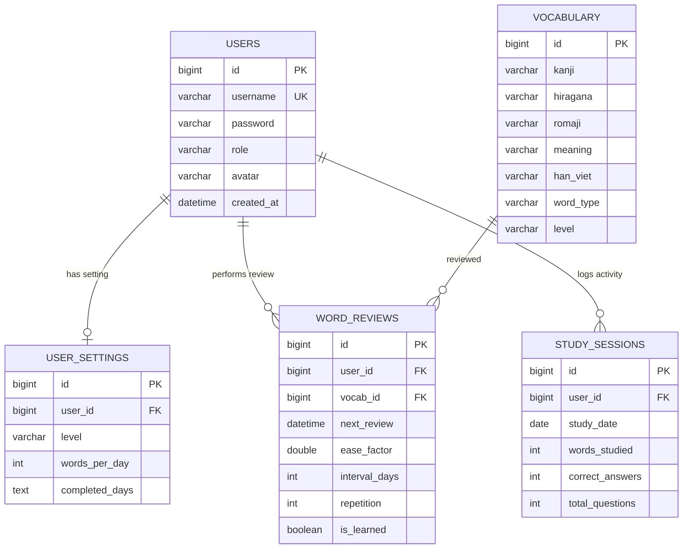

# 🗄️ Database Schema & Lucene (.ai/knowledge/database.md)

Tài liệu này đặc tả chi tiết thiết kế cơ sở dữ liệu quan hệ (MySQL/H2) và kiến trúc lập chỉ mục tìm kiếm văn bản Hibernate Search / Apache Lucene của dự án.

---

## 1. Sơ đồ thực thể quan hệ (ERD - Entity Relationship Diagram)

Lược đồ cơ sở dữ liệu được tổ chức như sau:



---

## 2. Danh sách các tệp Migration (Flyway SQL Script)

Cơ sở dữ liệu được khởi tạo và nâng cấp thông qua Flyway tại thư mục `backend/src/main/resources/db/migration/`:

* **`V1__init_schema.sql`**: Khởi tạo cấu trúc các bảng gốc `users`, `vocabulary`, `user_settings`, `word_reviews`, `study_sessions` và thiết lập khóa ngoại.
* **`V2__add_user_avatar.sql`**: Thêm cột `avatar` vào bảng `users` phục vụ đổi ảnh đại diện.
* **`V3__add_profile_fields.sql`**: Nâng cấp các trường thông tin trong bảng `users` (nếu có bổ sung).
* **`V4__add_completed_days.sql`**: Thêm cột `completed_days` (kiểu TEXT) trong `user_settings` để lưu danh sách các ngày đã hoàn thành của từng cấp độ học.
* **`V5__add_romaji.sql`**: Thêm cột `romaji` trong bảng `vocabulary` để lưu phiên âm Latin, hỗ trợ gõ tìm kiếm Romaji.
* **`V6__add_word_review_tracking.sql`**: Thêm cột `is_learned` (Boolean) vào bảng `word_reviews` để theo dõi chính xác trạng thái từ đã học của học viên, phục vụ quy tắc bảo toàn từ đã học khi ôn tập fail.

---

## 3. Cấu hình Hibernate Search & Apache Lucene Index

Để hỗ trợ tìm kiếm mờ thời gian thực hiệu năng cao, dự án sử dụng **Hibernate Search** kết hợp **Apache Lucene**:

* Lớp `Vocabulary.java` được đánh dấu annotation `@Indexed`.
* Các trường được lập chỉ mục tìm kiếm (`@FullTextField` hoặc `@KeywordField`):
  * `kanji`: Phục vụ tìm kiếm Hán tự.
  * `hiragana`: Phục vụ tìm kiếm chữ viết Kana.
  * `romaji`: Phục vụ tìm kiếm bằng phiên âm Latin.
  * `meaning`: Phục vụ tìm kiếm bằng nghĩa tiếng Việt.
* Lớp `SearchIndexer.java` thực hiện quét toàn bộ bảng từ vựng trong DB và khởi tạo chỉ mục Lucene lưu trên ổ đĩa cứng khi ứng dụng Spring Boot vừa khởi chạy:
  ```java
  SearchSession searchSession = Search.session(entityManager);
  MassIndexer indexer = searchSession.massIndexer(Vocabulary.class);
  indexer.startAndWait();
  ```
* Đường dẫn lưu file index ở môi trường sản xuất (EC2/Docker): `/data/lucene-index`.
* Môi trường local: `./data/lucene-index`.
