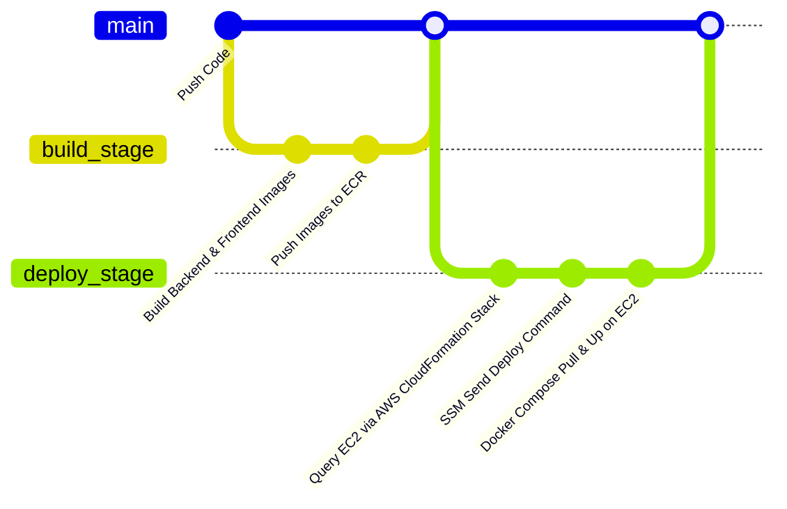

# 🚀 Deployment & GitLab CI/CD Pipeline (.ai/knowledge/deployment.md)

Tài liệu này đặc tả quy trình tự động hóa tích hợp và triển khai liên tục (CI/CD) của dự án **NihongoCards** lên môi trường điện toán đám mây Amazon Web Services (AWS).

---

## 1. AWS Cloud Architecture Setup

Hệ thống được vận hành trên nền tảng AWS Cloud với các dịch vụ chính:

* **EC2 Instance**:
  * Chạy Docker Engine và Docker Compose.
  * Được cài đặt **AWS Systems Manager (SSM) Agent** để giao tiếp bảo mật với GitLab Runner mà không cần mở cổng SSH (port 22).
  * Chạy dịch vụ **Nginx** làm Reverse Proxy chuyển tiếp các request từ cổng 80 vào container backend (cổng 8888/8080) và frontend (cổng 80).
* **AWS ECR (Elastic Container Registry)**:
  * Kho lưu trữ các Container Images riêng tư của dự án.
  * Tên Repo: `japaneseproject-backend` và `japaneseproject-frontend`.
* **AWS RDS (Relational Database Service)**:
  * Cơ sở dữ liệu MySQL 8.0 được quản lý hoàn toàn tự động, sao lưu định kỳ, nằm trong Subnet riêng tư của VPC.

---

## 2. GitLab CI/CD Pipeline Flow

Quy trình hoạt động được định nghĩa trong [.gitlab-ci.yml](file:///c:/Users/bbqdd/Documents/_my/japaneseproject/.gitlab-ci.yml):



### A. Stage 1: Build (`build_images`)
1. GitLab Runner khởi chạy một container Docker (sử dụng Docker-in-Docker `dind`).
2. Kiểm tra các biến môi trường cấu hình trong GitLab (`AWS_ACCOUNT_ID`, `AWS_REGION`).
3. Đăng nhập vào AWS ECR qua AWS CLI.
4. Đóng gói mã nguồn backend thành Image `japaneseproject-backend:latest` và frontend thành `japaneseproject-frontend:latest` bằng cách đọc các tệp Dockerfile tương ứng.
5. Đẩy (push) các image này lên repository AWS ECR của người dùng trên AWS Cloud.

### B. Stage 2: Deploy (`deploy_aws`)
1. Runner sử dụng image `amazon/aws-cli` để thực thi câu lệnh AWS CLI tương ứng.
2. Dùng câu lệnh truy vấn để tìm EC2 instance ID đang chạy thuộc CloudFormation stack `JapaneseProjectStack` ở khu vực AWS tương ứng.
3. Sử dụng tính năng **SSM Send Command** gửi lệnh Shell script từ xa đến EC2 instance để triển khai:
   ```bash
   cd /home/ec2-user/app
   aws ecr get-login-password --region $AWS_REGION | docker login --username AWS --password-stdin $AWS_ACCOUNT_ID.dkr.ecr.$AWS_REGION.amazonaws.com
   docker-compose pull
   docker-compose --env-file .env up -d --remove-orphans
   ```
4. SSM Agent trên EC2 nhận lệnh, kéo image mới từ ECR về, tắt container cũ và bật container mới mà không làm mất thời gian kết nối.

---

## 3. Environment Variables (CI/CD Config)

Các biến môi trường bắt buộc cần được thiết lập trong **GitLab -> Settings -> CI/CD -> Variables**:

* **`AWS_ACCOUNT_ID`**: ID tài khoản AWS của bạn (12 số).
* **`AWS_REGION`**: Khu vực AWS chứa dịch vụ của bạn (ví dụ: `ap-southeast-1`).
* **`AWS_ACCESS_KEY_ID`**: Khóa truy cập IAM User có quyền truy cập ECR và gửi lệnh SSM.
* **`AWS_SECRET_ACCESS_KEY`**: Khóa bí mật IAM User tương ứng.
