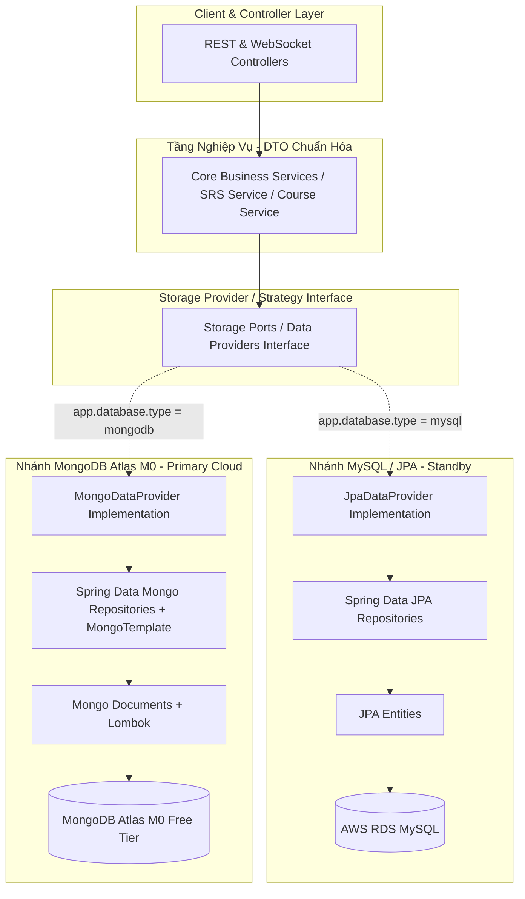

# 📋 Kế Hoạch Chuyển Đổi Hệ Thống Cơ Sở Dữ Liệu: MySQL RDS ➔ MongoDB Atlas (M0 Free Tier)
*(Architecture Modernization, Spring Ecosystem & Non-Breaking Cloud Migration Strategy)*

---

## 🎯 1. Mục Tiêu & Nguyên Tắc Cốt Lõi

### 1.1. Mục tiêu
- Chuyển đổi toàn bộ hệ thống lưu trữ dữ liệu từ **AWS RDS MySQL 8.0** sang **MongoDB Atlas (M0 Shared Cluster - Miễn phí trọn đời trên Cloud AWS)**.
- Triệt để cắt giảm chi phí hạ tầng AWS RDS sau khi hết 12 tháng Free Tier (~$15 - $20/tháng ➔ **0đ vĩnh viễn**).
- Tối ưu hóa hiệu năng đọc/ghi tài liệu phân cấp phức tạp (hội thoại AI, lịch sử tin nhắn, sửa lỗi, từ vựng giàu siêu dữ liệu, phân tích phát âm).
- Tận dụng tối đa sức mạnh của **Spring Framework Ecosystem** (`Spring Data MongoDB`, `MongoTemplate`, `@CompoundIndex`, `@TextIndexed`, `MongoTransactionManager`, `Lombok`, `Spring Profiles`) để viết code hiện đại, tinh gọn, dễ bảo trì.
- Giữ vững tính toàn vẹn tuyệt đối của thuật toán Spaced Repetition (**SM-2 / FSRS**), bảo toàn trạng thái `is_learned` và tiến trình học tập của người dùng.

### 1.2. Nguyên tắc bất biến & Thiết kế Kiến trúc
- **Tận dụng Framework & Lombok**: Bổ sung `Lombok` (`@Getter`, `@Setter`, `@Builder`, `@NoArgsConstructor`, `@AllArgsConstructor`) cho các Document/DTO mới, giải phóng boilerplate code dư thừa.
- **Bảo toàn ID kiểu `Long` (Zero-Breaking API)**: Áp dụng cơ chế Sequence Generator hoặc giữ nguyên ID `Long` từ MySQL để không làm vỡ các API endpoints (`@PathVariable Long id`), DTO và React Frontend.
- **Kiến trúc Dual-Mode / Non-Breaking**: Giữ nguyên toàn bộ code JPA cũ, phân tách các nhánh bằng **Spring Profiles / Conditional Beans** (`@ConditionalOnProperty(name = "app.database.type", havingValue = "mongodb")`).
- **Cô lập triệt để JPA & Hibernate Search**: Khi chạy chế độ MongoDB, hệ thống tự động vô hiệu hóa `DataSourceAutoConfiguration`, `FlywayAutoConfiguration` và `SearchIndexer` (Hibernate Search Lucene) để tránh lỗi văng app khi không có kết nối MySQL.
- **Tối ưu hóa dung lượng cho Atlas M0 (512 MB Storage Limit)**:
  - Cấu hình **TTL Indexes (Time-To-Live)** tự động xoá log cũ sau 90 ngày cho `review_logs` và `speaking_statistics`.
  - Nhúng (Embed) các quan hệ 1-N gắn kết chặt chẽ để giảm kích thước lưu trữ và tăng tốc truy vấn.

---

## 🏗️ 2. Mô Hình Kiến Trúc Chuyển Đổi (Dual-Mode Architecture)



---

## 📑 3. Bảng Đối Chiếu Thực Thể MySQL ➔ MongoDB Document Toàn Diện (Flyway V1 - V30)

| STT | MySQL Table (Hiện tại) | Mô hình NoSQL | MongoDB Document Mới | Ghi Chú Tối Ưu & Indexing |
| :---: | :--- | :--- | :--- | :--- |
| 1 | `users` | 1-1 Embedding | `UserDoc` | Nhúng `UserSettingDoc` trực tiếp trong User |
| 2 | `user_settings` | Nhúng (Embedded) | `UserSettingDoc` | Thuộc tính con của `UserDoc` |
| 3 | `vocabulary` | Chuyển đổi mảng | `VocabularyDoc` | Chuyển chuỗi phân tách dấu phẩy sang `List<String>`, đánh `@TextIndexed` trên `kanji`, `hiragana`, `romaji`, `meaning` |
| 4 | `grammar_cards` | Nhúng (Embedded) | `GrammarCardDoc` | Nhúng `List<GrammarExampleDoc>` và `List<GrammarQuizDoc>` |
| 5 | `word_reviews` | Document độc lập | `WordReviewDoc` | Compound Index: `{ userId: 1, nextReview: 1, isLearned: 1 }` và Unique Index: `{ userId: 1, vocabularyId: 1 }` |
| 6 | `grammar_reviews` | Document độc lập | `GrammarReviewDoc` | Index: `{ userId: 1, grammarCardId: 1 }` |
| 7 | `review_logs` | Document độc lập | `ReviewLogDoc` | **TTL Index: 90 ngày** (`@Indexed(expireAfter = "90d")`) để bảo toàn 512MB Atlas M0 |
| 8 | `conversations` | 1-N Embedding | `ConversationDoc` | Nhúng `List<MessageDoc>`, `List<CorrectionDoc>`, `RecommendationDoc` |
| 9 | `conversation_messages` | Nhúng (Embedded) | `MessageDoc` | Nằm trọn trong `ConversationDoc` |
| 10 | `conversation_corrections`| Nhúng (Embedded) | `CorrectionDoc` | Nằm trọn trong `ConversationDoc` |
| 11 | `review_recommendations` | Nhúng (Embedded) | `RecommendationDoc` | Nằm trọn trong `ConversationDoc` |
| 12 | `speaking_statistics` | Document độc lập | `SpeakingStatisticsDoc` | Index theo `userId`, TTL index 180 ngày |
| 13 | `study_sessions` | Document độc lập | `StudySessionDoc` | Index: `{ userId: 1, startTime: -1 }` |
| 14 | `daily_study_stats` | Document độc lập | `DailyStudyStatsDoc` | Index: `{ userId: 1, date: 1 }` |
| 15 | `knowledge_versions` | Document độc lập | `KnowledgeVersionDoc` | Quản lý versioning |
| 16 | `feedbacks` | Document độc lập | `FeedbackDoc` | Quản lý đóng góp và phản hồi |
| 17 | `achievements` | Document độc lập | `AchievementDoc` | Danh mục danh hiệu |
| 18 | `user_achievements` | Document / Embedded | `UserAchievementDoc` | Lưu huy hiệu đã mở khóa của User |
| 19 | `notifications` | Document độc lập | `NotificationDoc` | Quản lý thông báo người dùng |
| 20 | `jlpt_n3_progress` | Document độc lập | `JlptN3ProgressDoc` | Lưu tiến độ học khóa Somatome N3 |
| 21 | `grammar_quiz_cache` | Document độc lập | `JlptN3GrammarQuizDoc`| Cache câu hỏi trắc nghiệm ngữ pháp |
| 22 | `database_sequences` | Document hệ thống | `DatabaseSequenceDoc` | Phục vụ tự động tăng `Long ID` cho Documents |

---

## 🚀 4. Kế Hoạch Triển Khai Chi Tiết Qua 6 Phase

```mermaid
gantt
    title Lộ Trình 6 Phase Chuyển Đổi Sang MongoDB Atlas M0
    dateFormat  YYYY-MM-DD
    section Giai đoạn
    Phase 0: Khởi Tạo MongoDB Atlas & Cấu Hình Spring :p0, 2026-09-01, 3d
    Phase 1: Xây Dựng Document Models & Lombok      :p1, after p0, 7d
    Phase 2: Xây Dựng Data Access Layer & Adapters   :p2, after p1, 7d
    Phase 3: Pipeline Migration Dữ Liệu & Đối Soát  :p3, after p2, 5d
    Phase 4: Cắt Chuyển Hệ Thống (Cutover Trên AWS) :p4, after p3, 2d
    Phase 5: Giám Sát, Tối Ưu Atlas & Hủy RDS MySQL :p5, after p4, 7d
```

---

### 📍 Phase 0: Khởi Tạo MongoDB Atlas Cloud & Cấu Hình Spring Boot Context
* **Mục tiêu**: Thiết lập tài nguyên Cloud Atlas M0 và tách biệt Spring Configuration.
* **Công việc chính**:
  1. **Khởi tạo MongoDB Atlas M0**:
     - Tạo tài khoản MongoDB Atlas, chọn M0 Cluster (AWS Provider, Region gần nhất: Singapore `ap-southeast-1`).
     - Tạo Database User với quyền `readWrite` trên database `nihongocards`.
     - Cấu hình Network Access (IP Access List: Thêm Elastic IP của EC2 hoặc `0.0.0.0/0` với xác thực SCRAM-SHA-256).
  2. **Cập nhật `backend/pom.xml`**:
     - Bổ sung `spring-boot-starter-data-mongodb`.
     - Bổ sung `lombok` (`org.projectlombok:lombok`) với scope `provided`.
  3. **Cấu hình Spring Profile & Conditional Auto-Configuration**:
     - Tạo `MongoConfig.java` kích hoạt `@EnableMongoRepositories` và `@EnableMongoAuditing`.
     - Bật `spring.data.mongodb.auto-index-creation=true` để tự động tạo `@CompoundIndex`, `@TextIndexed` và TTL Indexes khi khởi động.
     - Cấu hình tắt Flyway và JPA DataSource khi `APP_DATABASE_TYPE=mongodb` bằng cách sử dụng `@ConditionalOnProperty`.
     - Tách `SearchIndexer.java` bằng `@Profile("mysql")` để tránh crash ứng dụng khi khởi động không có JPA.
     - Điều chỉnh `JwtAuthFilter.java` sử dụng `UserDataProvider` để nạp User vào `SecurityContext`, đảm bảo toàn bộ các `@AuthenticationPrincipal User` trong Controller tiếp tục hoạt động 100% không cần sửa code.
     - Tối ưu JVM trên EC2 `t3.micro` (1GB RAM): Cấu hình `JAVA_OPTS="-XX:MaxRAMPercentage=60.0 -XX:+UseG1GC"` trong Docker để tránh OOM.

---

### 📍 Phase 1: Xây Dựng Document Models & Tối Ưu NoSQL (Sử dụng Lombok)
* **Mục tiêu**: Xây dựng toàn bộ 22 Document models và Sequence Generator sạch đẹp bằng Lombok.
* **Công việc chính**:
  1. **Xây dựng `DatabaseSequenceDoc` & `SequenceGeneratorService`**:
     - Đảm bảo mỗi Document mới khi tạo đều có `Long id` tự tăng đồng nhất với MySQL.
  2. **Tạo các Document Models trong sub-packages `com.flashcard.*.document`**:
     - Dùng annotations: `@Document`, `@Id`, `@Indexed`, `@TextIndexed`, `@CompoundIndex`, `@CreatedDate`, `@LastModifiedDate`.
     - Dùng Lombok: `@Getter`, `@Setter`, `@NoArgsConstructor`, `@AllArgsConstructor`, `@Builder`.
  3. **Thiết lập Text Search trên `VocabularyDoc`**:
     - Khai báo `@TextIndexed` trên các trường `kanji`, `hiragana`, `romaji`, `meaning`, `hanViet`.
     - Tận dụng `TextQuery` và `TextCriteria` của Spring Data MongoDB để thay thế toàn diện Hibernate Search / Lucene.
  4. **Thiết lập TTL Index cho Atlas M0**:
     - `@Indexed(expireAfter = "90d")` trên `ReviewLogDoc.createdAt` và `SpeakingStatisticsDoc.createdAt`.

---

### 📍 Phase 2: Triển Khai Repository & Tầng Data Provider (Adapter Pattern)
* **Mục tiêu**: Cho phép ứng dụng hoán chuyển lưu trữ giữa MySQL và MongoDB chỉ bằng 1 biến môi trường.
* **Công việc chính**:
  1. **Tạo Spring Data Mongo Repositories**:
     - `UserMongoRepository`, `VocabularyMongoRepository`, `WordReviewMongoRepository`, `GrammarCardMongoRepository`, `ConversationMongoRepository`, `JlptN3ProgressMongoRepository`, v.v.
  2. **Xây dựng Data Providers / Adapters**:
     - Tạo Interface trừu tượng hoá việc truy xuất dữ liệu: `VocabularyDataProvider`, `SrsDataProvider`, `UserDataProvider`, `ConversationDataProvider`.
     - Triển khai `*JpaDataProvider` (gắn `@ConditionalOnProperty(name="app.database.type", havingValue="mysql", matchIfMissing=true)`).
     - Triển khai `*MongoDataProvider` (gắn `@ConditionalOnProperty(name="app.database.type", havingValue="mongodb")`).
  3. **Bảo toàn Thuật toán SM-2 / FSRS**:
     - Đảm bảo `SrsMongoDataProvider` tính toán và cập nhật chính xác `intervalDays`, `easeFactor`, `repetitions`, `nextReview` và giữ nguyên 100% cờ `isLearned`.

---

### 📍 Phase 3: Xây Dựng Công Cụ Migration ETL & Đối Soát Tự Động (Data Sync & Verification)
* **Mục tiêu**: Di chuyển toàn bộ dữ liệu hiện có trên MySQL sang MongoDB Atlas mà không làm mất mát dù chỉ 1 bản ghi.
* **Công việc chính**:
  1. **Xây dựng `MongoMigrationRunner` (Spring CommandLineRunner / REST Endpoint bảo mật)**:
     - Đọc dữ liệu từ JPA Repositories ➔ Chuyển đổi kiểu dữ liệu ➔ Bulk Write vào MongoDB Atlas:
       - Users & Settings ➔ `UserDoc`.
       - Vocabulary (phân tách chuỗi thành mảng `List<String>`) ➔ `VocabularyDoc`.
       - Grammar & Quizzes ➔ `GrammarCardDoc`.
       - WordReviews & GrammarReviews (bảo toàn `isLearned`, `nextReview`, `easeFactor`) ➔ `WordReviewDoc`.
       - Conversations + Messages + Corrections + Recommendations ➔ `ConversationDoc`.
       - Somatome N3 Progress & Quizzes ➔ `JlptN3ProgressDoc`, `JlptN3GrammarQuizDoc`.
       - Notifications & Achievements ➔ `NotificationDoc`, `AchievementDoc`, `UserAchievementDoc`.
       - Cập nhật giá trị Max ID vào `DatabaseSequenceDoc`.
  2. **Xây dựng `DataVerificationService` (Đối Soát Toàn Diện)**:
     - So khớp tổng số lượng bản ghi (Count Match) của tất cả 21 bảng.
     - So sánh Checksum ngẫu nhiên 500 bản ghi chi tiết giữa MySQL và MongoDB.
     - Xác thực riêng biệt bảng SRS: Kiểm tra 100% các từ đã `isLearned = true`.

---

### 📍 Phase 4: Cắt Chuyển Hệ Thống Trên AWS (Cutover to Atlas)
* **Mục tiêu**: Chuyển đổi chính thức sang MongoDB Atlas trên môi trường Production AWS.
* **Các bước thực hiện**:
  1. **Bước 1**: Chạy lần đồng bộ cuối cùng (Final Delta Sync) từ MySQL sang MongoDB Atlas.
  2. **Bước 2**: Chạy kiểm tra đối soát ➔ Đảm bảo kết quả 100% trùng khớp.
  3. **Bước 3**: Cập nhật file `.env` trên EC2:
     ```env
     APP_DATABASE_TYPE=mongodb
     SPRING_DATA_MONGODB_URI=mongodb+srv://<user>:<password>@cluster0.xxxx.mongodb.net/nihongocards?retryWrites=true&w=majority
     FLYWAY_ENABLED=false
     ```
  4. **Bước 4**: Khởi động lại container Backend:
     `docker-compose up -d --force-recreate backend`
  5. **Bước 5**: Kiểm tra `/actuator/health` và xác nhận toàn bộ luồng nghiệp vụ trên Frontend hoạt động mượt mà.

---

### 📍 Phase 5: Tối Ưu Hóa Atlas M0, Giám Sát & Hủy RDS MySQL
* **Mục tiêu**: Tối ưu hiệu năng, bảo đảm chi phí $0 và hoàn thiện tài liệu.
* **Công việc chính**:
  1. **Tối ưu Index & Performance trên Atlas**:
     - Kiểm tra Atlas Performance Advisor để xác nhận các truy vấn đều trúng Index.
     - Giám sát dung lượng lưu trữ (đảm bảo luôn < 400MB / 512MB limit).
  2. **Dọn dẹp Hạ tầng AWS (Cắt giảm chi phí)**:
     - Giữ RDS MySQL ở trạng thái dừng/backup trong 14 ngày làm phương án dự phòng.
     - Sau 14 ngày ổn định: Tạo Final Snapshot RDS ➔ Xóa RDS Instance `MyRDSInstance` trong AWS Console hoặc cập nhật lại `aws/template.yaml` để ngừng phát sinh bất kỳ chi phí nào từ AWS RDS.
  3. **Đồng bộ hóa tài liệu**:
     - Cập nhật `.ai/knowledge/database.md` và `SYSTEM_KNOWLEDGE.md`.

---

## 🔄 5. Kế Hoạch Rollback Dự Phòng (Zero-Risk Fallback)

Nếu phát sinh lỗi nghiêm trọng trên MongoDB Atlas:
1. **Thời gian phục hồi mục tiêu (RTO)**: < 2 phút.
2. **Thao tác đơn giản**:
   - Đổi lại biến môi trường trên EC2: `APP_DATABASE_TYPE=mysql` và `FLYWAY_ENABLED=true`.
   - Chạy lệnh restart: `docker-compose restart backend`.
   - Hệ thống ngay lập tức quay lại hoạt động 100% trên MySQL JPA cũ mà không cần sửa code hay rebuild container.
