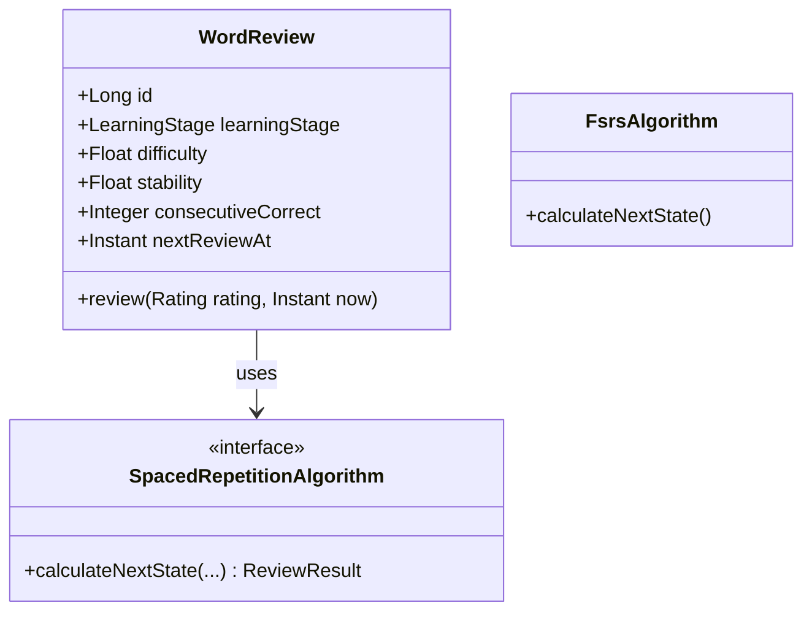

# System Architecture & Design: Personalized Spaced Repetition

Tài liệu này mô tả chi tiết thiết kế hệ thống "Personalized Spaced Repetition Vocabulary Learning" dựa trên thuật toán FSRS (Free Spaced Repetition Scheduler), tối ưu cho Spring Boot 3 và React.

## 1. System Architecture

Hệ thống tuân thủ **Clean Architecture** và **Domain-Driven Design (DDD)** cơ bản:
- **Domain Layer:** Chứa Core Business Logic (FSRS Algorithm, Learning Strategy, Entities). Không phụ thuộc vào framework.
- **Application Layer (Use Cases):** ChIA nhỏ các Service điều phối quy trình đảm bảo Single Responsibility:
  - `ReviewService`
  - `SchedulerService` (Queue prioritization)
  - `StatisticsService`
  - `LearningStrategyService` (Adaptive Daily Load)
  - `FSRSService` (Implementation logic)
- **Infrastructure Layer:** Chứa cấu hình Database (Spring Data JPA), Repositories Implementation, External API integration, Spring Security.
- **Presentation Layer:** Controllers (REST APIs) giao tiếp với Frontend.

## 2. Database Design & 3. Entity Design

Chúng ta cần lưu trạng thái học tập của từng user đối với từng từ vựng, cũng như lịch sử ôn tập.

### Bảng `word_reviews` (UserVocabulary)
Lưu trạng thái học tập hiện tại của một từ đối với một User. Chỉ lưu các chỉ số cho FSRS.
- `id` (PK)
- `user_id` (FK)
- `vocabulary_id` (FK)
- `learning_stage` (Enum): `NEW`, `LEARNING`, `MATURE`. Chỉ dùng phục vụ UI.
- `difficulty` (Float): Độ khó của từ (D trong FSRS).
- `stability` (Float): Độ bền vững của trí nhớ (S trong FSRS).
- `interval` (Integer): Số ngày cho lần ôn tiếp theo.
- `next_review_at` (Timestamp): Thời điểm cần ôn tập lại. 
- `last_reviewed_at` (Timestamp)
- `review_count` (Integer): Tổng số lần đã ôn.
- `correct_count` (Integer)
- `wrong_count` (Integer)
- `consecutive_correct` (Integer): Số lần trả lời đúng liên tiếp, phục vụ thống kê và ưu tiên hiển thị.

*Lưu ý:* Biến số `retrievability` (khả năng nhớ) sẽ được tính toán động (dynamically calculated) mỗi khi truy xuất: `f(stability, daysSinceReview)`. `ease_factor` của SM2 bị loại bỏ hoàn toàn.

**Indexes:**
- `idx_user_next_review` (`user_id`, `next_review_at`)

### Bảng `review_logs` (ReviewHistory)
Lưu log mỗi lần user trả lời.
- `id` (PK)
- `word_review_id` (FK)
- `rating` (Integer/Enum): `AGAIN(1)`, `HARD(2)`, `GOOD(3)`, `EASY(4)`.
- `difficulty_before` (Float)
- `difficulty_after` (Float)
- `stability_before` (Float)
- `stability_after` (Float)
- `shown_at` (Timestamp): Thời điểm hiển thị mặt trước.
- `answered_at` (Timestamp): Thời điểm user ấn trả lời.
- `algorithm_version` (String): Ghi nhận thuật toán áp dụng (VD: "FSRS_v1").
- `created_at` (Timestamp)

### Bảng `study_sessions` (Review Session)
Thống kê theo phiên học thay vì gộp chung vào nguyên ngày.
- `id` (PK)
- `user_id` (FK)
- `session_start` (Timestamp)
- `session_end` (Timestamp)
- `new_words_studied` (Integer)
- `words_reviewed` (Integer)
- `accuracy` (Float)

### Bảng `daily_study_stats` (Statistics)
Đóng vai trò rollup hàng ngày từ `study_sessions`.

## 4. Business Rules & Scheduling Priority

Thay vì fix cứng cảm tính, ta sử dụng **FSRS algorithm logic**. 

**Query lấy danh sách ôn tập (Review Queue) & Priority Score:**
Việc lấy danh sách từ không chỉ `ORDER BY next_review, difficulty` mà sử dụng một Priority Score:
`Priority = OverdueScore + DifficultyScore + WrongWeight + ConsecutiveWrong`
Thuật toán lập lịch (`SchedulerService`) sẽ tính toán trọng số này khi user gọi API lấy queue.
- *Ví dụ:* Một từ quá hạn 5 ngày sẽ được ưu tiên xuất hiện trước một từ khó quá hạn 1 ngày.

## 6. API Design & Dashboard

### `GET /api/v1/study/queue`
Lấy danh sách từ cần học, bao gồm review và từ mới. Trả về metadata cho mỗi từ gồm tính toán `retrievability`.

### `POST /api/v1/study/review`
Submit kết quả của một card.
**Request:**
```json
{
  "vocabularyId": 123,
  "rating": 3,
  "shownAt": "2026-07-20T08:00:00Z",
  "answeredAt": "2026-07-20T08:00:03Z"
}
```

### `GET /api/v1/study/dashboard`
Trả về Dashboard thực thụ:
- **Today's Workload** (Reviews Due, New Words)
- **Retention Rate** / **Accuracy**
- **Memory Health** (Tổng quan Retrievability toàn bộ vốn từ)
- **Upcoming Reviews** (Dự kiến 7 ngày tới)
- **Weak Spots** (Weak Deck, Weak Kanji, Weak Grammar)
- **Learning Streak**

## 8. Class Diagram (Core Domain)



## 11. Learning Strategy: Adaptive Daily Load

Chiến lược học được điều chỉnh thông qua `LearningStrategyService` nhằm tối ưu trải nghiệm và khả năng tiếp thu:
1. **Review first, New words later.**
2. **Adaptive Daily Load:** Số lượng từ mới mỗi ngày KHÔNG cố định. Nó phụ thuộc vào `Accuracy` hoặc `Retention Rate` của phiên/ngày hôm trước.
   - *Ví dụ:* Nếu hôm qua `Accuracy = 48%`, số từ mới hôm nay có thể giảm xuống `5`. Nếu `Accuracy = 95%`, có thể học `20` từ mới.
3. **Overdue Backlog Splitting:** Tránh nhồi 500 từ cùng lúc vào 1 ngày nếu người dùng nghỉ lâu. `SchedulerService` chia nhỏ lượng backlog và mix vào queue hợp lý.

## 12. Future Extension Plan

- Cốt lõi của hệ thống dựa trên `interface SpacedRepetitionAlgorithm`. 
- Bằng cách lưu lại `algorithm_version` (VD: "FSRS_v1", "ML_v1") trong `review_logs` và phân tách `shown_at` / `answered_at`, dữ liệu trong tương lai hoàn toàn trong sạch để huấn luyện Machine Learning. Khi muốn đổi sang model ML, ta chỉ cần tạo `MachineLearningAlgorithm` implement interface này. Database hoàn toàn không cần thay đổi cấu trúc bảng cốt lõi.
