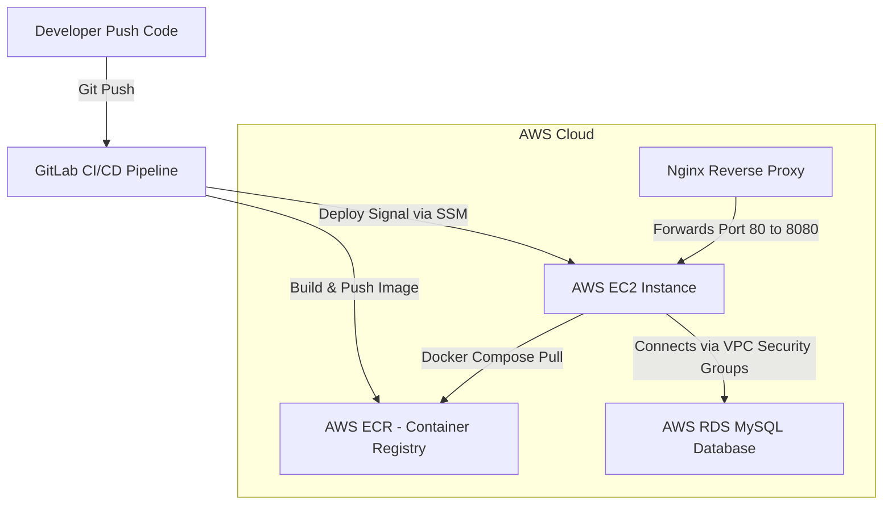

# 📖 Hướng Dẫn Kiến Thức Hệ Thống Toàn Diện (SYSTEM_KNOWLEDGE.md)

Tài liệu này tổng hợp toàn bộ kiến thức hiện tại của dự án **NihongoCards**, bao gồm kiến trúc công nghệ, các tính năng cốt lõi, quy trình phát triển và kiểm thử ở local, luồng triển khai (CI/CD) lên production trên AWS, cùng các thuật toán vận hành hệ thống.

---

## 🗂️ Mục lục
1. [Tổng Quan Hệ Thống](#1-tổng-quan-hệ-thống)
2. [Chi Tiết Công Nghệ (Tech Stack)](#2-chi-tiết-công-nghệ-tech-stack)
3. [Thuật Toán Cốt Lõi & Nghiệp Vụ](#3-thuật-toán-cốt-lõi--nghiệp-vụ)
4. [Môi Trường Phát Triển & Kiểm Thử Cục Bộ (Local)](#4-môi-trường-phát-triển--kiểm-thử-cục-bộ-local)
5. [Quy Trình Triển Khai Lên Production (AWS CI/CD)](#5-quy-trình-triển-khai-lên-production-aws-cicd)
6. [Đánh Giá Ưu Điểm & Nhược Điểm](#6-đánh-giá-ưu-điểm--nhược-điểm)

---

## 1. Tổng Quan Hệ Thống

**NihongoCards** là một ứng dụng SaaS thông minh hỗ trợ học từ vựng tiếng Nhật từ cấp độ N5 đến N1. Hệ thống hoạt động dựa trên phương pháp học tập giãn cách (**Spaced Repetition System - SRS**) giúp tối ưu hóa khả năng ghi nhớ từ vựng của học viên theo thời gian.

Hệ thống được thiết kế theo mô hình **Client-Server** phân tách hoàn toàn:
* **Frontend**: SPA (Single Page Application) xây dựng bằng React & Vite, giao diện tối (Dark Mode) bóng bẩy theo phong cách Glassmorphism.
* **Backend**: RESTful API sử dụng Java Spring Boot 3.5.x, bảo mật bằng JWT Stateless Token.

---

## 2. Chi Tiết Công Nghệ (Tech Stack)

### Backend (Spring Boot)
* **Ngôn ngữ & Runtime**: Java 21, Spring Boot 3.x.
* **Security & Auth**: Spring Security cấu hình Stateless, xác thực qua **JWT Bearer Token**.
* **Database Access**: Spring Data JPA kết hợp Hibernate.
* **Database Migrations**: **Flyway** quản lý phiên bản cơ sở dữ liệu (`backend/src/main/resources/db/migration/`).
* **Full-text Search**: **Hibernate Search** tích hợp **Apache Lucene** để lập chỉ mục phục vụ tìm kiếm nhanh chóng, đa dạng.
* **Rate Limiting**: Sử dụng thư viện **Bucket4j** (thuật toán Token Bucket) giới hạn tần suất yêu cầu ở các API nhạy cảm (như Auth) để chống tấn công Brute-force.
* **Monitoring**: **Spring Boot Actuator** cung cấp `/actuator/health` phục vụ kiểm tra trạng thái hoạt động của container.

### Frontend (React)
* **Build tool**: Vite (tốc độ đóng gói siêu tốc).
* **Styling**: Vanilla CSS (CSS thuần) tối ưu hóa kích thước bundle và thiết kế giao diện tùy biến tối đa.
* **Icons**: Thư viện `lucide-react`.
* **API Client**: Axios được trang bị Interceptors để tự động đính kèm Token và tự động logout khi nhận mã phản hồi lỗi `401/403` (Token hết hạn).

### Cơ Sở Dữ Liệu (Dual-Database)
* **Local (H2 File)**: Sử dụng H2 database dạng file lưu trữ tại `./data/flashcard` giúp lập trình viên phát triển nhanh không cần cài MySQL cá nhân.
* **Production / Docker Local**: Chạy cơ sở dữ liệu **MySQL 8.0** để đảm bảo tính an toàn dữ liệu, tính bền vững và hỗ trợ mở rộng.

---

## 3. Thuật Toán Cốt Lõi & Nghiệp Vụ

### 1. Thuật Toán Học Tập Giãn Cách (SM-2)
Hệ thống sử dụng thuật toán **SuperMemo-2 (SM-2)** để lập lịch ôn tập từ vựng cho từng người dùng:
* Khi học viên ôn tập một từ, họ sẽ đánh giá mức độ ghi nhớ theo thang điểm:
  * `1` - **Forgot** (Quên)
  * `2` - **Hard** (Khó)
  * `3` - **Good** (Tốt)
  * `4` - **Easy** (Dễ)
* **Cập nhật Ease Factor (EF)**:
  $$EF' = EF + (0.1 - (5 - q) \times (0.08 + (5 - q) \times 0.02))$$
  *(với $q$ là điểm đánh giá từ 1 đến 4, EF mặc định ban đầu là 2.5).*
* **Tính toán Khoảng cách ôn tập tiếp theo (Interval)**:
  * Lần học đầu tiên ($Repetition = 1$): $Interval = 1$ ngày.
  * Lần học thứ hai ($Repetition = 2$): $Interval = 6$ ngày.
  * Lần học thứ ba trở đi ($Repetition > 2$): $Interval' = Interval \times EF$.

> [!IMPORTANT]
> **Quy tắc bảo toàn từ đã học**: Khi từ vựng đã lọt vào danh sách **Tổng số từ đã học** (từng đạt đánh giá $\ge 3$), nếu sau này người dùng ôn tập lại mà đánh giá thấp (`Forgot` hoặc `Hard`), hệ thống sẽ reset chu kỳ lặp lại về `1` ngày chứ **không xóa từ vựng đó ra khỏi danh sách Tổng số từ đã học**.

### 2. Thuật Toán Tìm Kiếm Đa Năng (Fuzzy Search)
Được hỗ trợ bởi Hibernate Search / Lucene index, hệ thống tìm kiếm từ vựng theo cả 4 trường dữ liệu:
* **Kanji** (Hán tự)
* **Hiragana** (Kana)
* **Romaji** (Phiên âm chữ cái Latin)
* **Nghĩa tiếng Việt**
Sử dụng tìm kiếm mờ (Fuzzy matching) để xử lý sai sót gõ phím nhẹ hoặc thiếu dấu phụ trong tiếng Việt.

### 3. Biểu Đồ Lịch Sử Học Tập Commit-Style
* Được thiết kế tương tự biểu đồ đóng góp (commit grid) của GitHub.
* Số lượng từ học được đánh giá $\ge 3$ càng nhiều trong ngày thì màu sắc ô vuông tương ứng trên lưới hoạt động 30 ngày sẽ càng đậm.
* Đặt song song cùng hàng ngang với **Bảng xếp hạng điểm số** trên màn hình lớn và tự động xuống dòng trên thiết bị di động.

---

## 4. Môi Trường Phát Triển & Kiểm Thử Cục Bộ (Local)

Dự án cung cấp 2 phương pháp khởi chạy ở máy local:

### Cách 1: Chạy Direct (Không cần Docker)
Phương pháp này sử dụng H2 Database làm file lưu trữ cục bộ:
1. **Khởi động Backend**:
   ```bash
   cd backend
   ./mvnw.cmd spring-boot:run
   ```
2. **Khởi động Frontend**:
   ```bash
   cd frontend
   npm install
   npm run dev
   ```
   *Giao diện chạy tại: `http://localhost:5173`, API tại `http://localhost:8080`*

### Cách 2: Chạy Bằng Docker Compose (Khuyên Dùng)
Khởi động một môi trường hoàn chỉnh bao gồm cả cơ sở dữ liệu MySQL thật:
```bash
# Khởi động các container (Database, BE, FE)
docker compose -f docker-compose.local.yml up --build -d

# Dừng môi trường local
docker compose -f docker-compose.local.yml down
```
* **Giao diện Web**: `http://localhost` (Cổng 80)
* **API Backend**: `http://localhost:8080`
* **MySQL Database**: `localhost:3306` (User: `root`, Password: `root`, DB: `flashcard`)
* Dữ liệu MySQL được lưu trữ bền vững thông qua volume `db_data`, chỉ mục Lucene của backend lưu tại thư mục `./data` của host.

---

## 5. Quy Trình Triển Khai Lên Production (AWS CI/CD)

Luồng triển khai lên AWS được thực hiện hoàn toàn tự động thông qua **GitLab CI/CD**:



### Các bước trong GitLab CI/CD Pipeline (`.gitlab-ci.yml`):
1. **Build Stage (`build_images`)**:
   * GitLab Runner sử dụng Docker-in-Docker (`dind`) để đóng gói các Dockerfile của backend và frontend thành Container Images.
   * Sử dụng AWS CLI đăng nhập vào AWS ECR và đẩy các Image mới lên registry với thẻ `:latest`.
2. **Deploy Stage (`deploy_aws`)**:
   * GitLab Runner dùng AWS CLI tìm kiếm ID của EC2 đang chạy thuộc Stack CloudFormation `JapaneseProjectStack`.
   * Gửi lệnh triển khai từ xa thông qua **AWS Systems Manager (SSM) Agent** chạy trên EC2:
     * Truy cập thư mục `/home/ec2-user/app`.
     * Đăng nhập ECR, thực hiện kéo (`docker-compose pull`) các Image mới nhất.
     * Khởi động lại container bằng tệp sản xuất: `docker-compose --env-file .env up -d --remove-orphans`.
   * Nhờ sử dụng SSM Agent, cổng SSH (port 22) trên EC2 hoàn toàn có thể đóng lại, giúp hệ thống an toàn trước các cuộc tấn công quét cổng SSH.

---

## 6. Đánh Giá Ưu Điểm & Nhược Điểm

### Ưu Điểm (Pros)
* **Bảo mật và Hiệu Năng**: Hệ thống Stateless sử dụng JWT không lưu session trên RAM. Giới hạn yêu cầu bằng Bucket4j chặn Brute-force hiệu quả.
* **Tốc độ Triển Khai**: Quá trình CI/CD hoàn toàn tự động hóa. Đẩy code lên nhánh `main` sẽ cập nhật trực tiếp lên AWS chỉ sau chưa đầy 1 phút.
* **Tách biệt Dữ liệu**: Ứng dụng chạy trên container EC2 tách rời khỏi AWS RDS MySQL, đảm bảo nâng cấp hoặc xóa container ứng dụng không bao giờ làm mất dữ liệu người dùng.

### Nhược Điểm & Hướng Khắc Phục (Cons & Roadmap)
* **Từ đồng nghĩa tĩnh (Static Thesaurus)**: Hiện tại, danh sách từ đồng nghĩa tiếng Việt đang lưu ở mảng tĩnh frontend. Cần chuyển về lưu trong database (bảng `synonyms`) để admin quản lý trực tiếp qua giao diện admin.
* **Giao thức HTTP thường**: Hệ thống truy cập trực tiếp qua IP EC2 và chưa được cấu hình tên miền SSL. Cần trỏ tên miền (domain) về EC2 và tích hợp **Certbot / Let's Encrypt** trên Nginx để chạy HTTPS an toàn.
* **Tính năng Thu Phí (SaaS Billing)**: Hệ thống chưa phân quyền gói dịch vụ. Hướng đi tiếp theo là tích hợp các cổng thanh toán trực tuyến (PayOS, Momo, Stripe) để giới hạn số từ học mỗi ngày đối với gói Free.
