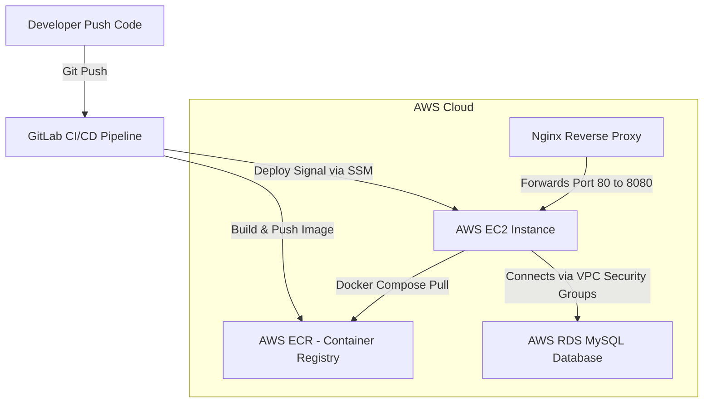

# 🏗️ Kiến trúc & Cách thức Hoạt động (ARCHITECTURE.md)

Tài liệu này mô tả chi tiết kiến trúc công nghệ, mô hình triển khai đám mây (Cloud Deployment) và các thuật toán cốt lõi vận hành hệ thống **NihongoCards**.

---

## 1. Công nghệ Sử dụng (Tech Stack)
Hệ thống tuân thủ cấu trúc gọn nhẹ, hiệu năng cao và phân tách rõ ràng giữa Frontend và Backend:

### Backend (Spring Boot 3.5.0)
* **Core:** Java 21, Spring Boot.
* **Security:** Spring Security cấu hình stateless, sử dụng **JWT Token** để xác thực người dùng.
* **Database Access:** Spring Data JPA kết hợp Hibernate.
* **Rate Limiting:** Sử dụng thư viện **Bucket4j** (thuật toán Token Bucket) để giới hạn tần suất yêu cầu ở các endpoint nhạy cảm (10 req/phút/IP trên Auth endpoints) nhằm chống Brute-force.
* **Monitoring:** Tích hợp **Spring Boot Actuator** để cung cấp endpoint kiểm tra sức khỏe hệ thống `/actuator/health`.

### Frontend (React & Vite)
* **Core:** React, Vite (môi trường đóng gói siêu tốc).
* **Styling:** CSS thuần (Vanilla CSS) xây dựng hệ thống Design Tokens nhất quán. Giao diện tối hiện đại, bóng bẩy (Glassmorphism).
* **Icons:** Lucide-react.
* **HTTP Client:** Axios tích hợp request/response interceptors (tự động đính kèm JWT và tự động logout khi token hết hạn 401/403).

### Cơ sở dữ liệu (Dual-Database Design)
* **Local Development:** Dùng **H2 database dạng File persistent** lưu tại thư mục `./data/flashcard`. Điều này giúp lập trình viên clone code về chạy ngay mà không cần cài đặt database cục bộ.
* **Production:** Kết nối với **AWS RDS MySQL** để đảm bảo dữ liệu của tất cả người dùng được lưu trữ an toàn, độc lập và vĩnh viễn.

---

## 2. Thuật toán Cốt lõi (Core Algorithms)

### Thuật toán học tập ngắt quãng SuperMemo-2 (SM-2)
Mỗi từ vựng khi bắt đầu học sẽ tạo ra một thực thể `WordReview`. Trạng thái của thẻ được tính toán lại sau mỗi lần ôn tập:
1. **Tính toán Ease Factor (Độ dễ - EF):** Giá trị mặc định là 2.5. Sau mỗi lần phản hồi, EF được cập nhật:
   $$EF' = EF + (0.1 - (5 - q) \times (0.08 + (5 - q) \times 0.02))$$
   *(với $q$ là điểm đánh giá của người dùng từ 1 đến 4).*
2. **Tính toán khoảng cách ngày ôn tập tiếp theo (Interval):**
   * Nếu lần ôn tập đầu tiên: $Interval = 1$ ngày.
   * Nếu lần ôn tập thứ hai: $Interval = 6$ ngày.
   * Các lần tiếp theo: $Interval' = Interval \times EF$.

### Thuật toán so khớp tiếng Việt thông minh (Fuzzy & Synonym Matching)
Khi người dùng làm Quiz nhập tiếng Việt, frontend áp dụng bộ so khớp 3 lớp:
1. **NFC Normalization:** Chuẩn hoá mã dựng sẵn Unicode để tránh xung đột kiểu gõ (Telex/VNI).
2. **Bản đồ từ đồng nghĩa:** Tra cứu chéo cụm từ đồng nghĩa trong cấu trúc mảng đa chiều đã khai báo sẵn.
3. **Levenshtein Distance:** Cho phép khoảng cách chỉnh sửa $\le 1$ đối với các từ có độ dài từ 4 ký tự trở lên để chấp nhận các lỗi gõ nhầm nhẹ hoặc thiếu dấu phụ.

---

## 3. Kiến trúc Triển khai Đám mây (SaaS AWS & CI/CD)

Hệ thống được đóng gói bằng Docker và deploy hoàn toàn tự động qua GitLab CI/CD:

### Chi tiết luồng vận hành trên EC2:
* **Nginx:** Lắng nghe ở cổng 80 (giao thức HTTP) với cấu hình wildcard `server_name _;` để người dùng truy cập trực tiếp qua IP của EC2 mà không cần tên miền. Nginx đóng vai trò Reverse Proxy chuyển tiếp các request `/api/` về cổng 8080 của container backend.
* **Docker Compose:** Quản lý 2 container: `app-frontend` chạy trên nền Nginx tĩnh và `app-backend` chạy file jar Java Spring Boot.
* **SSM Agent:** Giúp GitLab CI/CD chạy lệnh an toàn từ xa trên EC2 để kéo image mới và restart container mà không cần mở cổng SSH (port 22) ra ngoài internet.
